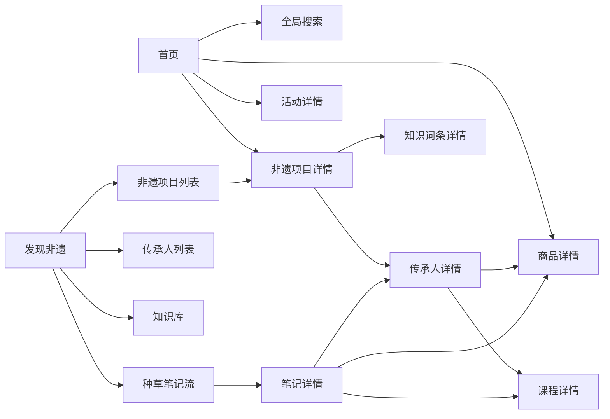
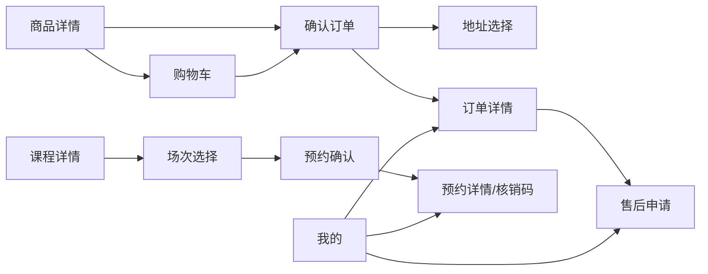

# 第一阶段微信 C 端页面架构

> 本文定义目标信息架构和路由契约，不修改现有 `pages.json`。AI 相关页面不在一期路由中。

## 1. 现有页面基线

现有 `client_code/pages.json:2-107` 注册 21 个页面，其中五个一级入口为：

| 现有入口 | 路由 | 结论 |
|---|---|---|
| 首页 | `/pages/index/index` | 保留 |
| 文创 | `/pages/shop/list` | 保留路由，名称调整为“商城” |
| 活动 | `/pages/activity/list` | 保留 |
| 社区 | `/pages/community/index` | 降为“发现非遗”内的种草子频道 |
| 我的 | `/pages/profile/index` | 保留 |

另外存在 `pages/studyroom/*`、`pages/reservation/*`、`pages/notice/*`、`pages/violation/*` 等停用模板，但未注册到 `pages.json`，且页面正文明确标注“该旧模板页已停用”，不能作为一期能力复用。

## 2. 一级入口建议

最终建议采用：**首页、发现非遗、商城、活动、我的**。

原因：

1. 当前“社区”已有内容流，但一期还需要承载非遗项目、传承人、知识库；升级为“发现非遗”可以避免增加第六个 Tab。
2. 种草笔记保留为“发现”默认推荐流或独立频道，不会丢失现有社区能力。
3. 商城、活动、我的均已有可运行页面，保留路由可降低迁移成本。
4. 首页负责运营聚合，发现负责主动探索，二者职责清晰。

目标 TabBar：

| 顺序 | 名称 | 目标路由 | 类型 | 迁移策略 |
|---:|---|---|---|---|
| 1 | 首页 | `/pages/index/index` | Tab | 原路由保留 |
| 2 | 发现非遗 | `/pages/discover/index` | Tab | 新增聚合页；原社区流作为子频道 |
| 3 | 商城 | `/pages/shop/list` | Tab | 原路由保留 |
| 4 | 活动 | `/pages/activity/list` | Tab | 原路由保留 |
| 5 | 我的 | `/pages/profile/index` | Tab | 原路由保留 |

不要直接把 `/pages/community/index` 重命名后删除。迁移期应保留旧路由并跳转到发现页的“种草”频道，避免收藏、分享卡片或旧二维码失效。

## 3. 页面树

```text
首页 /pages/index/index
├─ 全局搜索 /pages/search/index
├─ 非遗分类聚合 /pages/discover/projects
├─ 非遗项目详情 /pages/discover/project-detail
├─ 传承人详情 /pages/inheritor/detail
├─ 商品详情 /pages/shop/detail
├─ 活动详情 /pages/activity/detail
└─ 资讯详情 /pages/news/detail

发现非遗 /pages/discover/index
├─ 非遗项目 /pages/discover/projects
│  └─ 项目详情 /pages/discover/project-detail
│     ├─ 关联传承人 /pages/inheritor/detail
│     ├─ 关联知识词条 /pages/knowledge/detail
│     └─ 关联商品/课程详情
├─ 传承人 /pages/inheritor/list
│  └─ 传承人详情 /pages/inheritor/detail
│     ├─ 作品预览 /pages/inheritor/work-detail
│     ├─ 商品详情 /pages/shop/detail
│     └─ 课程详情 /pages/course/detail
├─ 科普 /pages/knowledge/list
│  └─ 词条详情 /pages/knowledge/detail
├─ 资讯 /pages/news/list
│  └─ 资讯详情 /pages/news/detail
└─ 种草 /pages/community/index
   ├─ 发布笔记 /pages/community/post
   └─ 笔记详情 /pages/community/detail

商城 /pages/shop/list
├─ 搜索/分类筛选（列表内）
├─ 商品详情 /pages/shop/detail
├─ 购物车 /pages/shop/cart
├─ 确认订单 /pages/shop/order
│  └─ 地址选择 /pages/profile/address-select
├─ 订单详情 /pages/order/detail
└─ 售后申请 /pages/after-sale/apply

活动 /pages/activity/list
├─ 活动详情 /pages/activity/detail
├─ 课程列表 /pages/course/list
├─ 课程详情 /pages/course/detail
├─ 场次选择 /pages/course/session-select
├─ 预约确认 /pages/reservation/confirm
└─ 预约详情/核销码 /pages/reservation/detail

我的 /pages/profile/index
├─ 登录 /pages/login/login
├─ 资料编辑 /pages/profile/edit
├─ 地址管理 /pages/profile/addresses
├─ 商城订单 /pages/profile/orders
│  └─ 订单详情 /pages/order/detail
├─ 预约记录 /pages/profile/reservations
│  └─ 预约详情 /pages/reservation/detail
├─ 售后记录 /pages/profile/after-sales
├─ 我的收藏 /pages/profile/favorites
├─ 我的关注 /pages/profile/follows
├─ 我的笔记 /pages/profile/posts
├─ 优惠券 /pages/profile/coupons
├─ 积分与流水 /pages/profile/points
└─ 传承人认证 /pages/profile/inheritor
```

## 4. 路由清单

状态说明：“保留”表示当前已注册；“改造”表示复用当前页面但扩充；“新增”表示一期需要新页面。

| 层级 | 页面 | 路由 | 登录 | 状态 | 主要入口/出口 |
|---|---|---|---:|---|---|
| 一级 | 首页 | `/pages/index/index` | 否 | 改造 | 搜索、项目、传承人、商品、课程、活动、资讯 |
| 一级 | 发现非遗 | `/pages/discover/index` | 否 | 新增 | 项目/传承人/科普/资讯/种草频道 |
| 一级 | 商城 | `/pages/shop/list` | 否 | 改造 | 商品详情、购物车 |
| 一级 | 活动 | `/pages/activity/list` | 否 | 改造 | 活动详情、课程列表 |
| 一级 | 我的 | `/pages/profile/index` | 部分 | 改造 | 个人业务入口汇总 |
| 二级 | 全局搜索 | `/pages/search/index` | 否 | 新增 | 多类型结果跳各详情 |
| 二级 | 非遗项目列表 | `/pages/discover/projects` | 否 | 新增 | 分类/级别/地域筛选 |
| 详情 | 非遗项目详情 | `/pages/discover/project-detail?id=` | 否 | 新增 | 传承人、词条、商品、课程 |
| 二级 | 传承人列表 | `/pages/inheritor/list` | 否 | 新增 | 地域/级别/品类/服务筛选 |
| 详情 | 传承人详情 | `/pages/inheritor/detail?id=` | 否 | 新增 | 关注、作品、商品、课程 |
| 详情 | 传承人作品 | `/pages/inheritor/work-detail?id=` | 否 | 新增 | 返回传承人详情 |
| 二级 | 知识库列表 | `/pages/knowledge/list` | 否 | 新增 | 分类/项目筛选 |
| 详情 | 知识词条 | `/pages/knowledge/detail?id=` | 否 | 新增 | 收藏、分享素材、关联项目 |
| 二级 | 资讯列表 | `/pages/news/list` | 否 | 保留 | 资讯详情 |
| 详情 | 资讯详情 | `/pages/news/detail?id=` | 否 | 改造 | 收藏、分享 |
| 二级 | 种草流 | `/pages/community/index` | 否 | 改造 | 笔记详情、发布 |
| 详情 | 笔记详情 | `/pages/community/detail?id=` | 否 | 改造 | 评论、点赞、业务挂载跳转 |
| 二级 | 发布/编辑笔记 | `/pages/community/post?id=` | 是 | 改造 | 图片/视频、标签、挂载对象 |
| 详情 | 商品详情 | `/pages/shop/detail?id=&skuId=` | 否 | 改造 | 购物车、确认订单、传承人 |
| 二级 | 购物车 | `/pages/shop/cart` | 是 | 改造 | 确认订单 |
| 二级 | 确认订单 | `/pages/shop/order` | 是 | 改造 | 地址选择、订单详情 |
| 详情 | 订单详情 | `/pages/order/detail?id=` | 是 | 新增 | 取消、确认收货、售后 |
| 二级 | 售后申请 | `/pages/after-sale/apply?orderItemId=` | 是 | 新增 | 售后详情 |
| 二级 | 课程列表 | `/pages/course/list` | 否 | 新增 | 课程详情 |
| 详情 | 课程详情 | `/pages/course/detail?id=` | 否 | 新增 | 场次选择、传承人 |
| 二级 | 场次选择 | `/pages/course/session-select?courseId=` | 否 | 新增 | 预约确认 |
| 二级 | 预约确认 | `/pages/reservation/confirm?sessionId=` | 是 | 新增 | 预约详情 |
| 详情 | 预约详情 | `/pages/reservation/detail?id=` | 是 | 新增 | 核销码、取消、改期 |
| 二级 | 地址管理 | `/pages/profile/addresses` | 是 | 新增 | 编辑地址 |
| 二级 | 地址选择 | `/pages/profile/address-select` | 是 | 新增 | 返回确认订单 |
| 二级 | 我的预约 | `/pages/profile/reservations` | 是 | 新增 | 预约详情 |
| 二级 | 售后记录 | `/pages/profile/after-sales` | 是 | 新增 | 售后详情 |
| 二级 | 我的关注 | `/pages/profile/follows` | 是 | 新增 | 传承人详情 |
| 二级 | 优惠券 | `/pages/profile/coupons` | 是 | 新增 | 商城/活动适用对象 |
| 二级 | 积分 | `/pages/profile/points` | 是 | 新增 | 流水、规则说明 |
| 二级 | 认证申请 | `/pages/profile/inheritor` | 是 | 改造 | 申请状态、资料补交 |

## 5. 核心跳转关系





## 6. 页面状态和权限规则

### 6.1 无需登录即可访问

- 首页、发现、搜索、项目/传承人/知识/资讯列表与详情。
- 商品、课程、活动列表与详情。
- 种草流与笔记详情。

### 6.2 触发时要求登录

- 收藏、关注、点赞、评论、发布笔记。
- 加购物车、下单、预约、报名。
- 个人中心内所有数据页。

继续复用 `common/session.js:39-50` 的 `requireLogin()` 交互，但后端必须独立校验 Token，不能信任客户端路由守卫。

### 6.3 统一页面状态

每个列表/详情页面都必须具备：

- 首次加载、骨架或明确加载提示；
- 空数据；
- 网络失败与重试；
- 资源已下架/已删除；
- 登录过期；
- 重复提交防护；
- 分页到底提示。

交易和预约页额外处理库存/余位变化、价格变化、重复订单、预约过期和状态冲突。

## 7. 页面参数约定

1. URL 只传资源标识和轻量上下文，如 `id`、`skuId`、`sessionId`、`channel`；不传完整业务对象。
2. 详情页始终按 ID 重新取数，避免使用过期列表缓存完成交易。
3. 确认订单的商品项放入受控的结算状态或由后端生成 `checkoutToken`，不要把价格作为可信 URL 参数。
4. 分享页使用稳定的业务 ID；下架内容应返回可解释的不可用状态，而非白屏。
5. 旧 `/pages/community/index` 分享路径在迁移期继续有效，并映射到 `/pages/discover/index?channel=notes`。

## 8. 分包建议

一期页面增多后，主包仅保留五个 Tab、登录和必要公共组件。建议按领域分包：

- `packageDiscover`：项目、传承人、知识、资讯；
- `packageTrade`：购物车、确认订单、订单详情、售后、地址；
- `packageExperience`：课程、场次、预约、核销；
- `packageSocial`：笔记发布/详情；
- `packageProfile`：个人记录、权益、认证。

分包属于后续实现任务；实施前应以微信开发者工具的主包大小和分包加载结果验收，不在本轮修改 `pages.json`。
