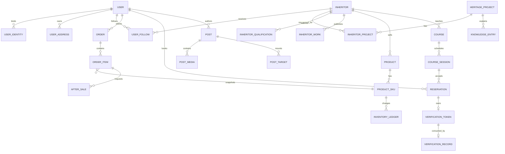

# 第一阶段数据库差距与目标设计

> 本文只提出数据模型和迁移建议，不包含或执行 `ALTER TABLE`、`DROP TABLE`、初始化数据等操作。

## 1. 审计限制与原则

正式项目当前没有 `heritage-platform/SQL/` 目录。现状依据后端 18 个活动实体、Mapper、Controller 以及已运行接口判断；实施前必须从当前已初始化的 MySQL 导出一份**只含结构、不含业务数据和密码**的 baseline，核对字段、索引、默认值和字符集。

现有活动实体包括：`admin`、`user`、`inheritor`、`news`、`performance`、`category`、`product`、`order`、`order_item`、`cart`、`activity`、`signup`、`banner`、`post`、`comment`、`favorite`、`heritage_project`、`post_like`。实体路径为 `server_code/src/main/java/com/example/server_code/entity/`。

设计原则：

1. 保留可复用主表，使用可回滚的增量迁移，不直接删除旧字段。
2. 交易、库存、预约、名额、核销、优惠券、积分全部使用事务与幂等键。
3. 公开档案和敏感资质分表；身份证、证照原件不得由公开 DTO 或静态 URL 返回。
4. 状态字段采用统一字典或代码枚举，并保留状态变更日志。
5. 金额使用 `DECIMAL`，时间统一存储策略，业务编号建立唯一索引。
6. 一期仅预留 `ai_narration_id` 等可空字段，不建立任何 AI 业务表。

## 2. 需求能力逐项检查

| 能力 | 现有表/字段 | 支持度 | 主要缺口 | 建议 |
|---|---|---:|---|---|
| 非遗项目 | `heritage_project` | 部分 | 无官方编号、认定机构、完整内容、关系模型 | 扩展主表，新增项目媒体和关系表 |
| 非遗级别 | `heritage_project.level` 字符串 | 部分 | 值不受控，县/区级口径不统一 | 新增 `heritage_level` 字典，主表存 code/FK |
| 非遗分类 | `heritage_project.category` 字符串；`category` 更偏商品 | 部分 | 项目分类与商品分类混用风险 | 新增带 `biz_type` 的分类体系或独立 `heritage_category` |
| 传承人 | `inheritor` | 部分 | 公开档案、服务标签、传承脉络不足 | 保留主表并扩展公开字段和关系 |
| 传承人资质 | `id_card/certificate` 单字段 | 不足 | 多证件、有效期、审核、私有存储、脱敏缺失 | 新增 `inheritor_qualification` 和审核日志 |
| 作品 | `inheritor.作品展示` 单字符串 | 不足 | 非规范字段名，不能支持多图/视频/排序 | 新增 `inheritor_work`；旧字段迁移后再废弃 |
| 商品 | `product` | 部分 | 无传承人/项目、类型、履约、资质关系 | 扩展商品主表 |
| 商品规格 | 无 | 缺失 | 无规格模板、规格值、SKU组合 | 新增规格、规格值、SKU表 |
| 库存 | `product.stock` | 不足 | 单库存、无预占、版本、流水 | 库存下沉 SKU，新增库存流水 |
| 课程 | 无；`activity/performance` 只能近似 | 缺失 | 无课程类型、教学模式、价格、讲师 | 新增 `course` |
| 课程场次 | 无 | 缺失 | 无日期时段、容量、地点、状态 | 新增 `course_session` |
| 预约 | `signup` 仅活动报名 | 部分 | 无课程场次、金额、参与人、改期退款 | 新增 `reservation`；活动报名继续用 `signup` |
| 核销 | 无 | 缺失 | 无核销码、操作人、时间、设备和幂等记录 | 新增核销凭证/记录 |
| 收货地址 | 订单内只有地址快照 | 缺失 | 无多地址/默认地址 | 新增 `user_address`，订单继续保存快照 |
| 订单 | `order/order_item` | 部分 | 创建即已支付、无类型/状态日志/履约信息 | 扩展订单并新增状态日志、支付预留 |
| 售后 | 无 | 缺失 | 无退货退款/证据/仲裁 | 新增 `after_sale` 及状态日志 |
| 收藏 | `favorite(type,target_id)` | 可改造 | 类型只支持 news/product/activity/post | 扩展 project/inheritor/course/knowledge 并保持唯一约束 |
| 关注 | 无 | 缺失 | 无用户—传承人关系 | 新增 `user_follow` |
| 笔记 | `post/comment/post_like` | 部分 | 媒体、视频、标签、业务挂载、审核日志不足 | 保留 `post` 物理表，新增媒体/标签/挂载表 |
| 优惠券 | 无 | 缺失 | 无模板、领取、使用、回退 | 新增三类券表 |
| 积分 | 无 | 缺失 | 无账户、规则、流水、幂等 | 新增账户、流水、规则表 |

## 3. 现有表改造建议

### 3.1 `user`

现有字段见 `server_code/src/main/java/com/example/server_code/entity/User.java:15-28`。

建议：

- 保留用户主表，不把 OpenID、SessionKey 等直接混入业务资料。
- 密码字段迁移为自适应哈希；增加 `password_algo/password_migrated_at` 或通过哈希前缀识别。
- 手机号、邮箱等敏感字段明确加密/脱敏策略。
- 新增 `user_identity`：`user_id/provider/open_id/union_id/status/last_login_time`，其中 `(provider, open_id)` 唯一。
- 短信验证码单独使用短时存储或 `sms_verification` 审计记录，禁止明文长期保存验证码。

### 3.2 `heritage_project`

现有字段见 `HeritageProject.java:13-23`。

建议增加：

- `official_code`：官方名录编号，唯一或按认定机构组合唯一；
- `category_id`、`level_code`；
- `recognition_authority`、`recognition_batch`、`recognized_at`；
- `history_content`、`craft_content`、`culture_content`；
- `publish_status`、`published_at`；
- `ai_narration_id`：可空预留字段，一期不产生 AI 业务行为。

新增 `heritage_project_media(project_id, media_type, url, cover_url, sort, status)`。

### 3.3 `inheritor`

现有实体同时包含公开资料和 `phone/idCard/certificate`，见 `Inheritor.java:13-28`，需要拆分访问边界。

主表建议保留/增加：

- `display_name`、`portrait`、`region_code`、`profile`；
- `lineage`、`experience_years`；
- `public_phone_enabled` 或咨询方式配置，不直接公开真实手机号；
- `audit_status`、`display_status`、`published_at`。

关系表：

- `inheritor_project(inheritor_id, project_id, relation_type, is_primary)`；
- `inheritor_service(inheritor_id, service_type, status)`；
- `inheritor_work(inheritor_id, title, description, media_type, media_url, cover_url, sort, status)`。

敏感表：

- `inheritor_qualification(id, inheritor_id, qualification_type, certificate_no_cipher, issuer, valid_from, valid_to, file_object_key, masked_summary, audit_status, audit_remark, audited_by, audited_at)`；
- `inheritor_audit_log(inheritor_id, action, before_status, after_status, remark, operator_id, created_at)`。

资质文件只保存私有对象键，查看时通过鉴权后的短时授权接口返回。

### 3.4 `category`

现有 `Category.java:14-19` 只有名称、父级、排序、状态。建议增加：

- `code`；
- `biz_type`：`HERITAGE/PRODUCT/KNOWLEDGE/COURSE`；
- `icon`、`description`；
- 唯一键 `(biz_type, code)`。

若团队希望不同领域独立治理，可拆成独立字典表；一期必须先冻结一种方案，不能让 `heritage_project.category` 与 `product.category_id` 长期并存为两套含义。

### 3.5 `product`

现有字段见 `Product.java:15-30`。

建议增加：

- `inheritor_id`、`heritage_project_id`；
- `product_type`：`PHYSICAL/CUSTOM/VIRTUAL`；
- `fulfillment_type`：`DELIVERY/PICKUP/VIRTUAL`；
- `qualification_required`、`merchant_qualification_id`；
- `freight_template_id`；
- `audit_status`、`publish_status`；
- `ai_narration_id`：可空预留。

主表价格/库存只作为展示聚合值，真实可售价格和库存由 SKU 决定。

### 3.6 `cart`

将 `product_id` 扩展为 `sku_id`，保留 `quantity`，增加 `selected`、`invalid_reason`。唯一键应为 `(user_id, sku_id)`。迁移期兼容旧 `product_id`，完成数据回填后再评估删除旧字段。

### 3.7 `order` 与 `order_item`

现有 `Order.java:16-45`、`OrderItem.java:14-23` 可以保留主结构，但需要增加：

- 订单：`order_type`、`payable_amount`、`discount_amount`、`freight_amount`、`fulfillment_type`、`address_id`、`version`、`expired_at`；
- 支付预留：`payment_status/payment_channel/transaction_no`，真实微信支付接入另行审批；
- 履约：快递公司、运单号、提货门店；
- 明细：`sku_id/spec_snapshot/inheritor_id/project_id/refundable_amount`；
- `order_status_log(order_id, from_status, to_status, action, operator_type, operator_id, idempotency_key, created_at)`。

订单仍保存收货人和地址快照，不能只关联可编辑的地址表。

### 3.8 `activity` 与 `signup`

`activity/signup` 继续用于平台市集、公益活动、展会等“活动报名”，不要承担收费课程预约。

建议：

- 活动增加 `category_id/city_code/address_detail/signup_start_at/signup_end_at/rule_text/fee_type`；
- 报名增加 `signup_no/participant_count/contact_snapshot/version`；
- 保持 `(activity_id,user_id)` 唯一约束；
- 名额更新使用事务内条件更新或独立配额记录，不能继续“先 count 再 insert”。

### 3.9 `favorite`

当前通用结构适合复用。扩展允许类型：

`heritage_project`、`inheritor`、`product`、`activity`、`course`、`knowledge`、`post`、`news`。

保留 `(user_id,type,target_id)` 唯一约束，并增加 `(type,target_id)` 索引方便统计。服务端使用枚举白名单校验，不接收任意类型。

### 3.10 `post/comment/post_like`

为兼容现有代码，物理表一期继续使用 `post`，产品术语和 API 使用“笔记”。

`post` 建议增加：

- `note_type`、`audit_status`、`audit_remark`、`published_at`；
- `location_name/city_code`；
- `is_featured/featured_at`；
- `author_type`、`influencer_id` 可空。

新增：

- `post_media(post_id, media_type, url, cover_url, duration, width, height, sort)`；
- `tag` 与 `post_tag(post_id, tag_id)`；
- `post_target(post_id, target_type, target_id, sort)`，允许挂载商品、课程、传承人；
- `content_audit_log(target_type, target_id, status, reason, operator_id, created_at)`。

## 4. 必须新增的核心表

### 4.1 字典与非遗档案

| 表 | 核心字段 | 关键约束 |
|---|---|---|
| `heritage_level` | `code,name,sort,status` | `code` 唯一 |
| `heritage_project_media` | `project_id,media_type,url,sort,status` | 项目+排序索引 |
| `inheritor_project` | `inheritor_id,project_id,relation_type,is_primary` | 传承人+项目唯一 |
| `inheritor_qualification` | 资质类型、编号密文、有效期、私有文件键、审核信息 | 私有访问；到期索引 |
| `inheritor_work` | 作品标题、媒体、排序、状态 | 传承人索引 |
| `inheritor_service` | 服务类型、状态 | 传承人+服务类型唯一 |
| `user_follow` | `user_id,inheritor_id,created_at` | 用户+传承人唯一 |

### 4.2 商品、库存与履约

| 表 | 核心字段 | 关键约束 |
|---|---|---|
| `product_spec` | `product_id,name,sort` | 商品索引 |
| `product_spec_value` | `spec_id,value,sort` | 规格+值唯一 |
| `product_sku` | `product_id,sku_code,spec_json,price,stock,reserved_stock,version,status` | `sku_code` 唯一；库存非负 |
| `inventory_ledger` | `sku_id,biz_type,biz_no,change_qty,before_qty,after_qty,idempotency_key` | 幂等键唯一 |
| `user_address` | 用户、收件人、手机号、地区码、详细地址、默认标记 | 用户默认地址一致性 |
| `freight_template` | 模板名称、计费方式、规则、状态 | 商家/平台归属 |
| `merchant_qualification` | 主体、类型、有效期、私有文件、审核状态 | 资质到期索引 |
| `after_sale` | 售后号、订单明细、类型、原因、金额、状态 | 售后号唯一 |
| `after_sale_log` | 售后单、状态变化、操作人、备注 | 售后单+时间索引 |

### 4.3 课程、场次、预约与核销

| 表 | 核心字段 | 关键约束 |
|---|---|---|
| `course` | 传承人、项目、课程类型、服务模式、价格、时长、规则、审核/发布状态 | 传承人/状态索引 |
| `course_session` | 课程、开始/结束、地点、容量、已占、版本、状态 | 课程+开始时间索引 |
| `reservation` | 预约号、用户、场次、人数、金额、联系人快照、状态 | 预约号唯一；用户+场次索引 |
| `reservation_change_log` | 预约、变更类型、原/新场次、原因、操作人 | 预约索引 |
| `verification_token` | 业务类型、业务ID、令牌摘要、有效期、状态 | 令牌摘要唯一，不存明文码 |
| `verification_record` | 凭证、核销人、核销时间、设备、幂等键 | 凭证唯一成功核销；幂等键唯一 |

### 4.4 科普知识库

| 表 | 核心字段 | 关键约束 |
|---|---|---|
| `knowledge_entry` | 项目、分类、标题、摘要、正文、来源、审核/发布状态 | 项目/分类/状态索引 |
| `knowledge_media` | 词条、媒体类型、URL、封面、排序 | 词条索引 |
| `knowledge_section` | 词条、章节类型、标题、内容、排序 | 词条+排序唯一 |

`news` 继续存行业政策、展会、赛事和通知；不要与 `knowledge_entry` 合并。

### 4.5 优惠券与积分

| 表 | 核心字段 | 关键约束 |
|---|---|---|
| `coupon_template` | 券类型、门槛、面额、适用范围、有效期、总量、状态 | 模板业务号唯一 |
| `user_coupon` | 用户、模板、券码、状态、领取/过期/使用时间 | 券码唯一 |
| `coupon_use_log` | 用户券、订单、动作、幂等键 | 幂等键唯一 |
| `points_account` | 用户、可用积分、冻结积分、版本 | 用户唯一 |
| `points_ledger` | 用户、业务类型/编号、变动值、余额、过期时间、幂等键 | 幂等键唯一 |
| `points_rule` | 行为类型、积分值、每日上限、状态、生效区间 | 行为+版本唯一 |

## 5. 关系总览

## 6. 事务与并发边界

必须由 Service 层提供事务：

1. **下单**：校验 SKU → 原子预占/扣库存 → 创建订单/明细 → 写库存流水/状态日志。
2. **取消/超时关闭**：状态条件更新 → 释放库存 → 回退优惠券/积分 → 写日志。
3. **预约**：场次余位条件更新 → 创建预约 → 生成核销凭证。
4. **改期**：锁定原/新场次 → 释放原余位 → 占用新余位 → 写变更日志。
5. **核销**：凭证条件更新为已核销 → 写唯一核销记录；重复请求返回同一结果。
6. **售后**：状态机变化、退款记录、库存回补和权益回退必须使用同一业务幂等键。
7. **优惠券/积分**：使用与回退都写不可变流水，禁止只覆盖余额。

## 7. 索引与约束建议

- 所有业务号：唯一索引，如订单号、预约号、售后号、SKU编码、券码。
- 所有用户中心列表：`(user_id, status, create_time)` 组合索引。
- 内容公开列表：`(publish_status, sort, published_at)` 或相应筛选组合索引。
- 项目筛选：`category_id`、`level_code`、`region_code`。
- 传承人筛选：公开状态、地域；服务类型通过关系表索引。
- 场次查询：`(course_id,status,start_time)`。
- 目标关系表：双方 ID 均应分别建立索引。
- 金额、库存、容量、积分均增加非负校验；若 MySQL版本/兼容模式无法可靠执行 CHECK，则由数据库约束与 Service 条件更新共同保证。
- 逻辑删除不能代替审核/下架状态；涉及财务、核销、审核的记录禁止物理删除。

## 8. 隐私与文件安全

| 数据 | 存储建议 | 返回规则 |
|---|---|---|
| 身份证号 | 应用层加密，另存脱敏摘要 | C 端永不返回；审核端默认脱敏 |
| 资质证书原件 | 私有对象存储键 | 审核授权后短时 URL |
| 手机号 | 加密或字段级保护 | 非本人/非授权管理员脱敏 |
| 收货地址 | 业务库加密保护 | 仅订单本人和授权履约人员 |
| 核销码 | 只存不可逆摘要 | C 端短时展示，服务端验证摘要 |
| JWT/微信密钥 | 环境变量/密钥管理 | 永不入库或返回前端 |

现有 `UploadController#uploadImage` 返回公开 `/uploads/...`，且 `WebMvcConfig#addResourceHandlers` 公开整个目录（`server_code/src/main/java/com/example/server_code/controller/UploadController.java:29-52`、`server_code/src/main/java/com/example/server_code/config/WebMvcConfig.java:17-22`）。它只能继续承载公开图片，不能用于身份证和资质原件。

## 9. 迁移实施顺序

1. 导出并提交脱敏 schema baseline；为每次变更建立版本化迁移目录。
2. 建立字典、管理员权限、私有文件和审核日志。
3. 扩展非遗项目/传承人并迁移旧 `certificate/作品展示` 数据。
4. 建立 SKU/库存/地址/订单状态日志，双写验证后切换交易链路。
5. 建立课程/场次/预约/核销。
6. 建立知识词条、笔记媒体/标签/挂载。
7. 最后接入优惠券和积分，避免在不稳定订单模型上重复改造。

每个迁移必须包含：前置检查、DDL、数据回填、校验查询、回滚方案和兼容期说明。本轮不生成这些迁移 SQL。
